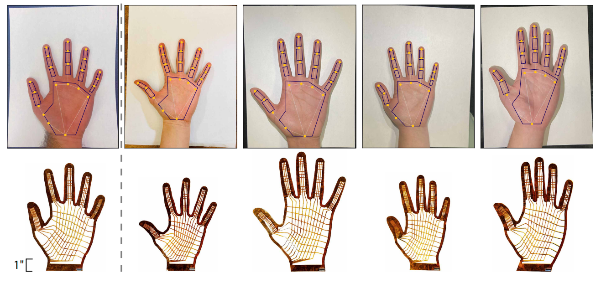
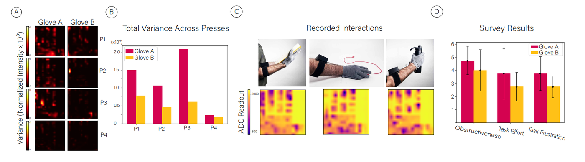

## Tactile Sensing for All
Resistive tactile sensing gloves have captured the interest of researchers spanning diverse domains, such as robotics, healthcare, and human-computer interaction. However, existing fabrication methods often require labor-intensive assembly or costly equipment and assume a one-size-fits-all design, limiting accessibility. 

Leveraging flexible printed circuit board (FPCB) technology, we present an automated pipeline for generating resistive tactile sensing glove design files solely from a simple hand photo on legal-size paper, which can be readily supplied to commercial board houses for manufacturing. Our method enables cost-effective, accessible production at under $130 per glove with sensor assembly times under 15 minutes.

## Fits like a Flex-Glove
A preliminary user evaluation  (N=5) was conducted to evaluate automatically manufactured designs for their reliability and comfort. 

Credit:
Devin Murphy

 We found that personalized gloves exhibited lower overall pressure variance, suggesting that personalized designs reduce hand placement variability and improve consistency across repeated use.  The personalized gloves were rated as less obstructive (Mean = 4.0, SD = 1.58), requiring less effort (Mean = 2.75, SD = 1.09), and causing less frustration (Mean = 2.75, SD = 0.83) 

Credit:
Devin Murphy

## Understanding the Nature of Touch
We envision this work helping to democratize human-hand centric touch sensing, making it possible to collect bimanual manipulation data at scale and deepening our understanding of human touch for applications such as human-robot task transfer, physically realistic object interaction in virtual reality, and translation from image to touch. 