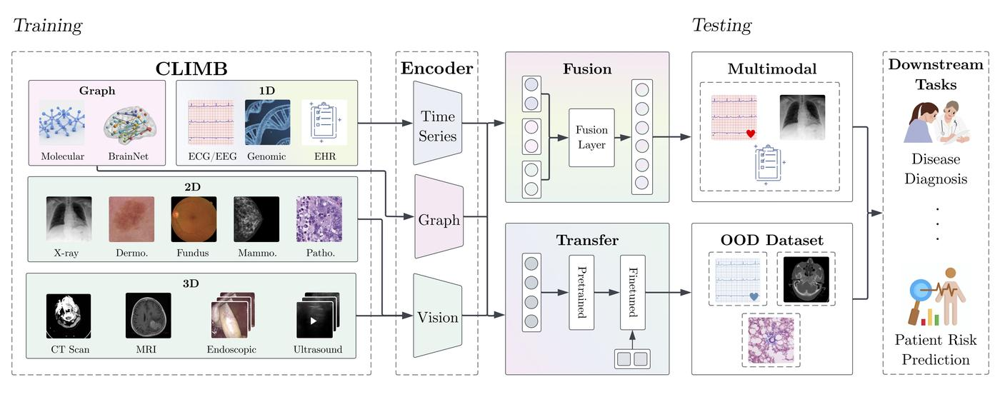
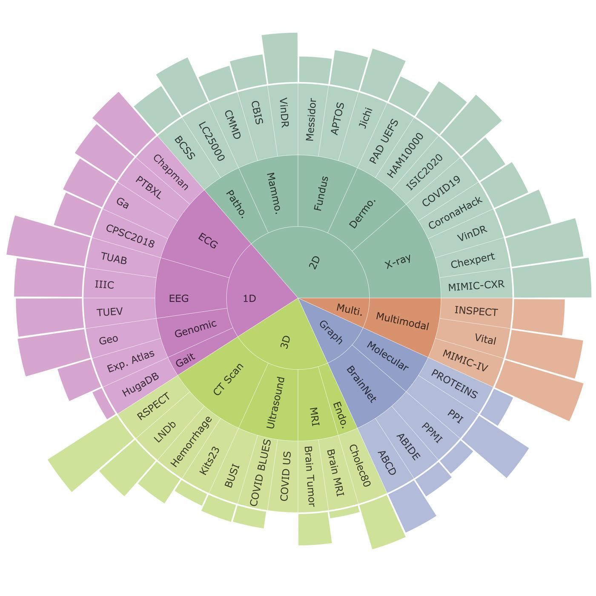
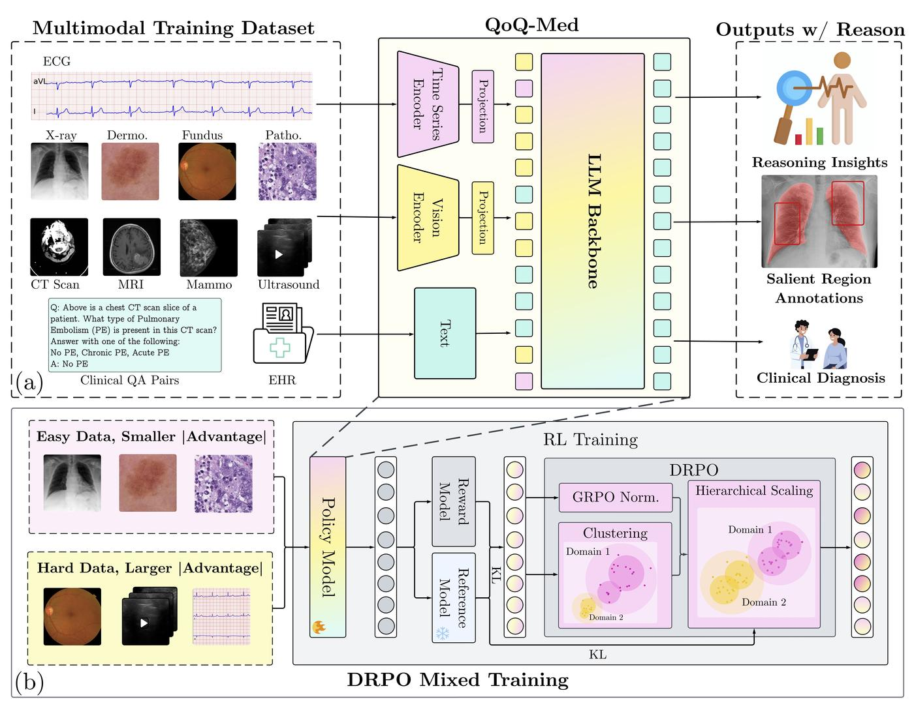
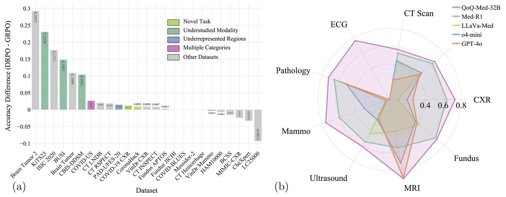
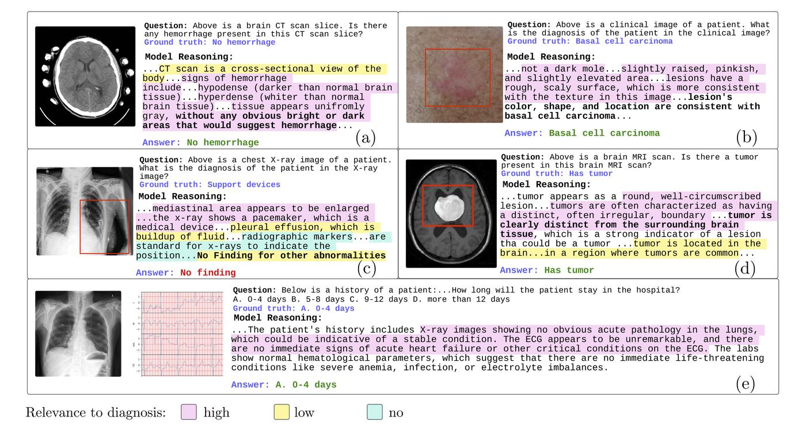

Cover: Canva

When you visit a doctor, they don't just look at one thing. Your physician might listen to your heart, examine an X-ray, review your blood work, and ask about your symptoms—all while drawing from years of experience treating similar cases. This holistic approach, combining multiple sources of information to form a complete picture, is what makes human doctors so effective. Yet most medical AI systems today can only look at one piece of the puzzle at a time.

At MIT Media Lab, we've been working to change that. Our goal isn't to replace the nuanced judgment of physicians, but to create tools that can help them see patterns across the vast landscape of medical data, spotting patterns that might be difficult for any single person to spot.

## The Challenge of Medical Complexity

Credit:
David Dai

Imagine you're a doctor in an emergency room. A patient arrives with chest pain. You might order an ECG to check their heart rhythm, a chest X-ray to examine their lungs, and blood tests to look for signs of a heart attack. Each test tells part of the story, but the real skill lies in weaving these threads together into a coherent diagnosis.

Now multiply this complexity across thousands of conditions, dozens of imaging types, and countless combinations of symptoms. This is the daily reality of modern clinical practice, a field where the amount of available data has exploded far beyond what any individual can fully process.

We asked ourselves: What if we could create an AI system that could look at all these different types of medical data simultaneously, much like an experienced physician does? Not to make decisions for doctors, but to help them see connections they might miss, especially in complex cases or rare conditions.

## Building a Medical Polyglot

Credit:
Wei Dai

Our first step was ambitious: we assembled CLIMB (Clinical Large-scale Integrative Multi-modal Benchmark), one of the most comprehensive collections of medical data ever compiled for AI research. This dataset brings together 4.51 million patient samples across virtually every type of medical data you can imagine—from traditional X-rays and CT scans to ECG heart rhythms, brain wave patterns, and even molecular structures.

What makes CLIMB special isn't just its size, but its diversity. We deliberately included data from 37 medical institutions across 18 countries, ensuring our systems learn from the full spectrum of human health conditions as they appear around the world. This includes data from regions like Vietnam, Brazil, and India—areas often underrepresented in medical AI research but crucial for building systems that work for everyone.

Think of CLIMB as a medical textbook written in dozens of different languages—visual, temporal, molecular—all describing the same fundamental reality of human health. Our challenge was teaching AI to read all these languages fluently.

## Teaching AI to Think Like a Doctor

Credit:
Wei Dai

 With this foundation, we developed QoQ-Med, an AI system that can examine multiple types of medical data simultaneously and, crucially, explain its reasoning process. When QoQ-Med analyzes a case, it doesn't just provide an answer—it shows its work, highlighting the specific areas in images or patterns in data that led to its conclusions.

For instance, when examining a CT scan for signs of bleeding in the brain, QoQ-Med might note: "I can see a bright white area in the left frontal lobe, which is characteristic of acute hemorrhage. The surrounding tissue shows signs of swelling, suggesting this occurred recently." It then draws a box around the exact region it's discussing, allowing physicians to immediately verify its observations.

This transparency is essential. In medicine, understanding why a conclusion was reached is often as important as the conclusion itself. A doctor needs to know whether an AI spotted the same subtle shadow they're concerned about, or if it's flagging something entirely different.

## The Challenge of Balance

Credit:
Wei Dai

One of our biggest technical challenges was ensuring the system learns effectively from all types of medical data, not just the most common ones. In any hospital, chest X-rays far outnumber brain MRIs, and common conditions like pneumonia appear much more frequently than rare genetic disorders. Without careful design, an AI system will naturally focus on these common cases while neglecting the rare but critical ones.

We developed a new training approach called Domain-aware Relative Policy Optimization (DRPO) that acts like an experienced teacher, ensuring the AI pays appropriate attention to both common and rare conditions. The results were dramatic—we saw up to 43% improvement in the AI's ability to handle understudied conditions like ultrasound imaging and mammography.

This might seem like a technical detail, but it has profound implications. Many rare diseases take years to diagnose precisely because they're so uncommon that even experienced doctors might see only a handful of cases in their careers. An AI system that can learn from cases worldwide could help physicians recognize these conditions earlier.

## A New Kind of Collaboration

Credit:
Wei Dai

What excites us most about this work isn't the technology itself, but how it might transform medical practice. Imagine a primary care physician in a rural clinic who rarely sees certain tropical diseases. With AI assistance that can recognize patterns from cases worldwide, they might catch something that would otherwise be missed. Or consider a specialist reviewing a complex case—the AI might notice subtle connections between the patient's ECG pattern and their brain scan that suggest a rare genetic condition affecting both organs.

We've seen glimpses of this potential in our experiments. When physicians reviewed QoQ-Med's reasoning process, they often found the AI's observations clinically relevant. It's like having a highly observant colleague who might not always reach the right conclusion but consistently notices important details worth considering.

## Looking Forward
Our work represents just the beginning of what's possible when AI systems can see medicine holistically. By releasing our datasets, models, and training methods publicly, we hope to enable researchers worldwide to build on these foundations.

The future we envision isn't one where AI replaces physicians, but where every doctor has access to a tireless assistant that can help them see patterns across millions of cases, spot rare conditions they might never have encountered, and ensure that no important detail goes unnoticed. It's about augmenting human expertise with computational breadth—combining the irreplaceable judgment and empathy of physicians with the pattern-recognition capabilities of AI.

Medicine has always been both an art and a science. Our goal is to enhance the science while preserving the art, giving physicians new tools to see their patients more clearly and completely than ever before. In a world where medical knowledge doubles every few years and new imaging technologies constantly emerge, we believe this kind of human-AI collaboration isn't just useful—it's essential for delivering the best possible care to every patient, everywhere.

