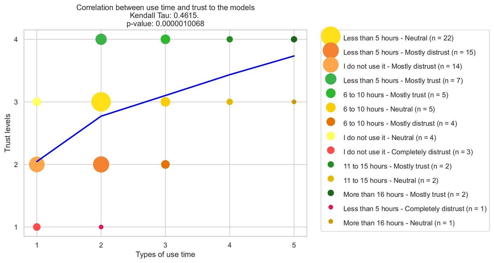

Language models (LMs) are revolutionizing knowledge retrieval and processing in academia. However, concerns regarding their misuse and erroneous outputs, such as hallucinations and fabrications, are reasons for distrust in LMs within academic communities. Consequently, there is a pressing need to deepen the understanding of how actual practitioners use and trust these models. There is a notable gap in quantitative evidence regarding the extent of LM usage, user trust in their outputs, and issues to prioritize for real-world development. 

This study addresses these gaps by providing data and analysis of LM usage and trust. Specifically, our study surveyed 125 individuals at a private school and secured 88 data points after pre-processing. Through both quantitative analysis and qualitative evidence, we found a significant variation in trust levels, which are strongly related to usage time and frequency. Additionally, we discover through a polling process that fact-checking is the most critical issue limiting usage. 

These findings inform several actionable insights: distrust can be overcome by providing exposure to the models, policies should be developed that prioritize fact-checking, and user trust can be enhanced by increasing engagement. By addressing these critical gaps, this research not only adds to the understanding of user experiences and trust in LMs but also informs the development of more effective LMs. 

